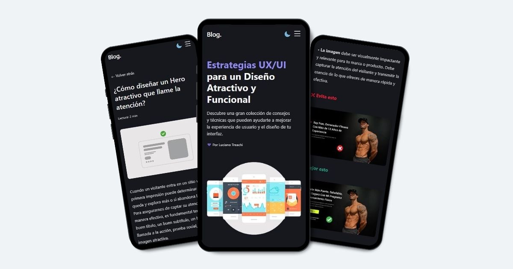

# Blog sobre estrategias UX/UI

**Blog sobre estrategias UX/UI** es un Blog sobre consejos, técnicas y estrategias UX/UI para lograr un diseño atractivo, intuitivo y funcional.

## Vista previa

## Tecnologías utilizadas

- Vite
- React 18
- CSS Modules
- Cloudinary

## Explora el Blog

Accede aquí → [Blog UX/UI](https://bloguxui.vercel.app/)

## Desarrollado por

**Luciano Treachi**

Soy un Desarrollador Frontend dedicado a crear soluciones web eficientes, accesibles, intuitivas y fáciles de usar que potencian la experiencia del usuario.

